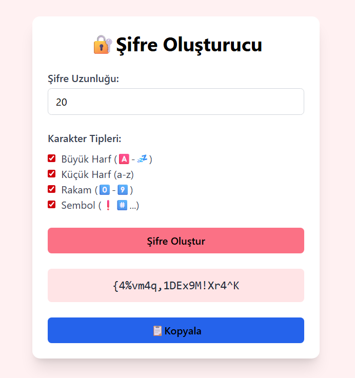
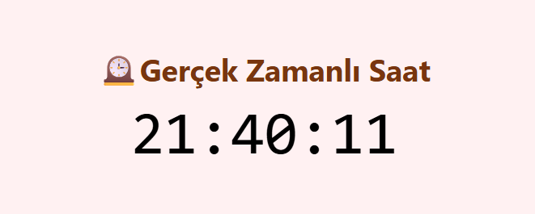
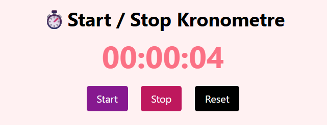
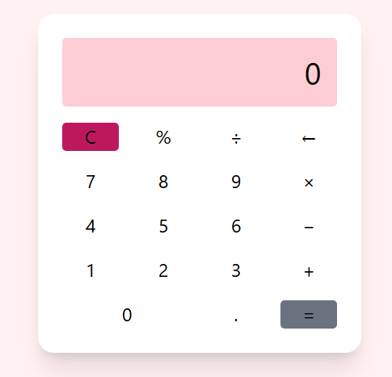

# 👩🏻‍💻JavaScript ile Fonksiyonellik Kazandırılan Projeler

## 🔒Şifre Oluşturucu🔒

Bu proje, kullanıcının belirlediği kriterlere göre güvenli ve rastgele şifreler üreten basit ama etkili bir web uygulamasıdır. HTML, Tailwind CSS ve JavaScript kullanılarak geliştirilmiştir.

#### 💾Özellikler
- Şifre uzunluğunu kullanıcı belirler
- Karakter türü seçimi:
  - Büyük harf (A-Z)
  - Küçük harf (a-z)
  - Rakam (0-9)
  - Sembol (!@#$%^&)
- Şifreyi anında ekranda gösterme
- Tek tıkla kopyalama özelliği 
- Hatalı girişlere karşı kullanıcı uyarıları
- Responsive

#### 📸

## ⏳Zaman Uygulamaları Projesi⏳

Bu projede üç farklı zaman temelli JavaScript uygulaması geliştirilmiştir. Her biri HTML,JavaScript veTailwind CSS kullanılarak oluşturulmuştur:

1. **Gerçek Zamanlı Saat**
2. **Start/Stop Kronometre**
3. **Belirli Zamana Geri Sayım Sayacı**

### 🕧1.Gerçek Zamanlı Saat
Kullanıcının cihazındaki saat bilgisine göre saniye saniye güncellenen bir dijital saat göstermek.

- `new Date()` ile güncel zaman alınır
- Saat, dakika ve saniyeler 2 basamaklı formatta gösterilir 
- `setInterval()` ile her saniye güncellenir

#### 📸

### ⏱️2.Start/Stop Kronometre
Kullanıcının başlatıp durdurabileceği ve sıfırlayabileceği bir kronometre yapmak.

- Başlat, Durdur ve Reset butonları
- `setInterval()` ile sayaç artar
- `clearInterval()` ile sayaç durur
- Süre formatı: `00:00:00`

#### 📸

### ⏲️3.Belirli Zamana Geri Sayım Sayacı
Kullanıcının belirlediği dakika ve saniyeye göre geri sayım başlatmak.

- Dakika ve saniye input alanları
- "Başlat" butonu ile geri sayım başlar
- Geri sayım sıfırlandığında “Süre Doldu!” mesajı gösterilir
- Sürekli olarak kalan süre güncellenir

#### 📸

## 🧮Hesap Makinesi🧮
Bu proje, HTML, Tailwind CSS ve JavaScript kullanılarak geliştirilmiş basit ama işlevsel bir hesap makinesi uygulamasıdır. Kullanıcıların toplama, çıkarma, çarpma, bölme gibi işlemleri yapmasını sağlar. Ayrıca temizleme, geri silme, yüzde hesaplama ve ondalık sayı desteği içerir.

#### 💾Özellikler
- Toplama, Çıkarma, Çarpma ve Bölme işlemlerini yapma
- Gerçek zamanlı ekran güncellemesi
- Ondalık sayı desteği
- Eşittir (=) butonuyla anında hesaplama
- Temizle (C) tuşuyla tüm veriyi silme
- Geri silme (←) ile son karakteri silme
- Yüzde hesaplama (%) özelliği
- Responsive
- Hata kontrolü 

#### 📸

